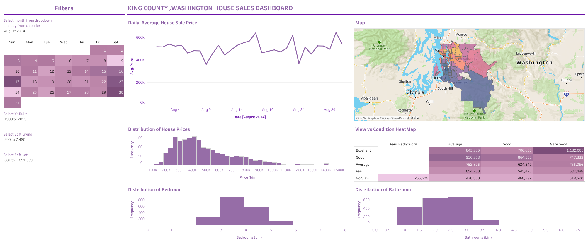

# King County House Sales (Tableau)

## Dashboard Preview

## Live Dashboard
[View on Tableau Public](https://public.tableau.com/app/profile/sunny.raj4326/viz/KingCountyHouseSales_17085101466730/KingCountyHouseSales?publish=yes)

## Objective
Analyse 21,613 house sales in King County, Washington to identify
what drives premium pricing and how market behaviour shifts
across different price segments.

## Tools Used
Tableau · Excel · EDA

## Dataset
| Field | Description |
|---|---|
| Sale price | Final transaction price |
| Bedrooms / bathrooms | Property size indicators |
| Square footage | Interior and lot size |
| Condition / grade | Property quality rating |
| View | Waterfront or scenic view |
| Year built | Age of property |
| Location | Zipcode and coordinates |

## Key Findings
- **Bulk market** — $200K–$600K captures the majority of transactions
- **Threshold Effect** — above $600K the market behaves differently:
  - Fewer transactions, higher price variance
  - Bedrooms and size stop predicting price
  - Condition rating becomes the dominant pricing driver
- **Waterfront premium** — waterfront properties command a 32% price premium across 21,613 homes
- **Top price driver** — "Very Good condition + View" commands the highest average prices in the dataset

## Methodology
1. Exploratory data analysis to understand price distribution
2. Segmentation by price band to identify threshold behaviour
3. Interactive filters built for date range, square footage, and year built
4. Waterfront and condition analysis across all price segments
